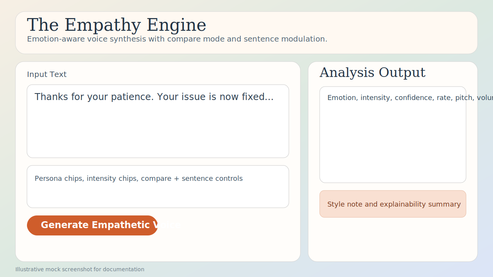
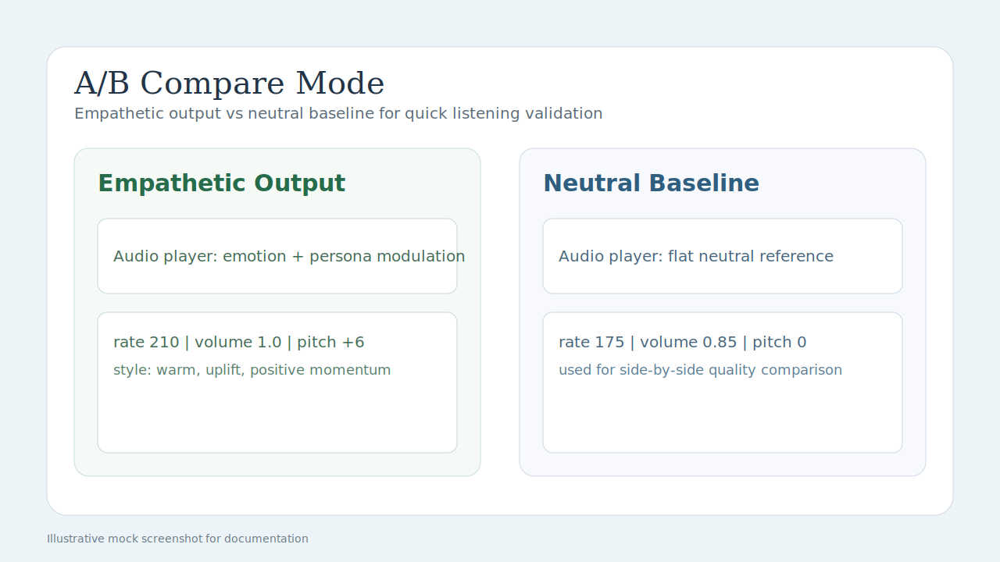
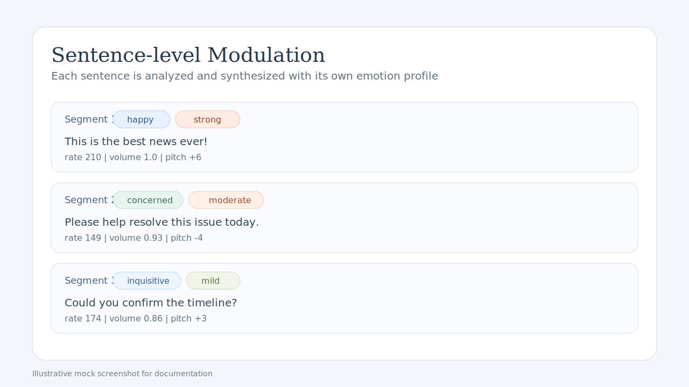
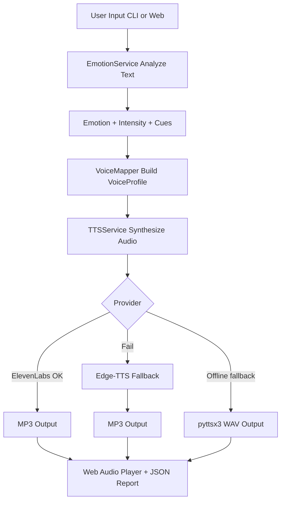
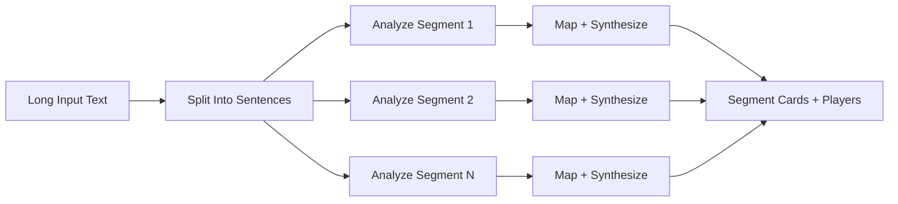
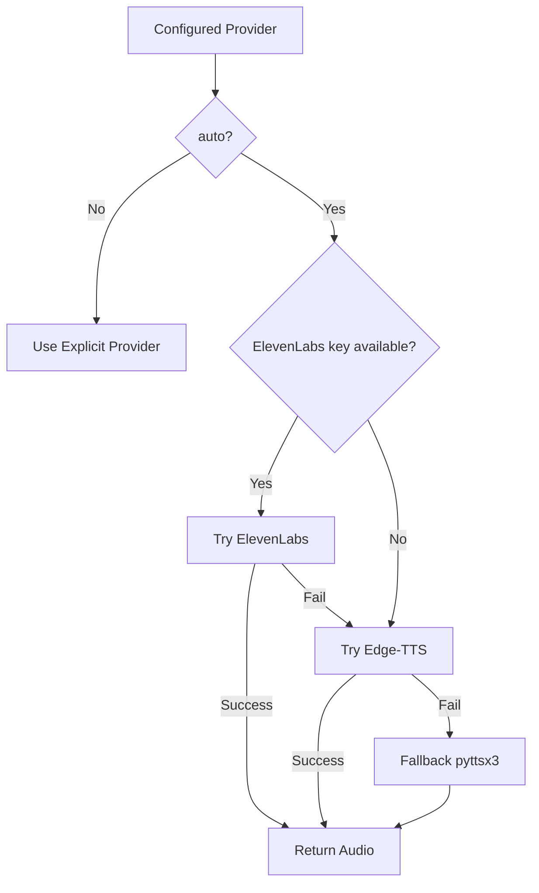

# The Empathy Engine

The Empathy Engine is an emotion-aware speech generation system that converts plain text into expressive audio. It detects emotional intent, maps that intent into voice parameters (rate, volume, pitch), and synthesizes playback-ready audio with explainability artifacts.

This project was built for the problem statement: **"The Empathy Engine: Giving AI a Human Voice."**

## Table Of Contents
- [Why This Project](#why-this-project)
- [Feature Set](#feature-set)
- [Screenshots](#screenshots)
- [System Flowcharts](#system-flowcharts)
- [Repository Structure](#repository-structure)
- [Technology Stack](#technology-stack)
- [Quick Start](#quick-start)
- [Environment Configuration](#environment-configuration)
- [Usage Guide](#usage-guide)
- [Output Artifacts](#output-artifacts)
- [Deployment Guide Render](#deployment-guide-render)
- [Testing](#testing)
- [Architecture Notes](#architecture-notes)
- [Troubleshooting](#troubleshooting)
- [Security Notes](#security-notes)
- [Roadmap](#roadmap)

## Why This Project
Most default TTS systems sound flat in customer-facing scenarios. This project closes that gap by combining sentiment analysis, rule-based emotional cues, persona presets, and dynamic voice modulation.

Result: the same text can sound empathetic, neutral, energetic, or calm depending on context.

## Feature Set
### Core Requirements Covered
- Text input via CLI and web UI.
- Emotion detection with 3+ classes.
- Programmatic modulation of multiple voice parameters.
- Explicit emotion-to-voice mapping logic.
- Playable audio file generation (`.mp3` or `.wav`).

### Advanced Features
- Granular emotion labels: `happy`, `neutral`, `frustrated`, `surprised`, `concerned`, `inquisitive`.
- Intensity scaling: `mild`, `moderate`, `strong`, plus manual override.
- Persona presets: `support`, `sales`, `executive`.
- Compare mode: empathetic output vs neutral baseline.
- Sentence-level modulation: per-sentence analysis and synthesis.
- Prosody enhancer: punctuation and phrasing adjustments for natural rhythm.
- Explainability report export (`.json`) with cues and mapping metadata.
- Multi-provider fallback: `elevenlabs` -> `edge-tts` -> `pyttsx3`.
- Improved UX: responsive controls, loading overlay, keyboard-friendly selectors.

## Screenshots
> The following documentation visuals are included in this repository under `docs/screenshots/`.

### 1. Main Web Interface


### 2. A/B Compare Mode


### 3. Sentence-Level Modulation View


## System Flowcharts
### End-To-End Request Flow


### Sentence-Level Modulation Flow


### Provider Selection Strategy


## Repository Structure
```text
.
├── app/
│   ├── services/
│   │   ├── emotion_service.py
│   │   ├── tts_service.py
│   │   └── voice_mapper.py
│   ├── static/
│   ├── templates/
│   │   └── index.html
│   ├── models.py
│   ├── settings.py
│   └── web.py
├── docs/
│   └── screenshots/
│       ├── ui-overview.svg
│       ├── compare-mode.svg
│       └── sentence-modulation.svg
├── outputs/
├── tests/
├── main.py
├── requirements.txt
├── render.yaml
└── README.md
```

## Technology Stack
- **Language:** Python 3.11+
- **Web Framework:** FastAPI + Jinja2
- **Emotion Analysis:** VADER sentiment + rule-based cues
- **TTS Providers:** ElevenLabs API, edge-tts, pyttsx3
- **Server:** Uvicorn
- **Testing:** unittest

## Quick Start
### 1. Clone And Enter Project
```bash
git clone https://github.com/anujsoni3/Voice-emotionAI.git
cd Voice-emotionAI
```

### 2. Create Virtual Environment
```bash
python -m venv .venv
.venv\Scripts\activate
```

### 3. Install Dependencies
```bash
python -m pip install -r requirements.txt
```

### 4. Configure Environment
```bash
copy .env.example .env
```

Then edit `.env` as needed.

### 5. Run Web App
```bash
python main.py --web
```

Open: `http://127.0.0.1:8000`

## Environment Configuration
Example `.env`:

```env
EMPATHY_TTS_PROVIDER=auto
ELEVENLABS_API_KEY=your_api_key_here
ELEVENLABS_VOICE_ID=EXAVITQu4vr4xnSDxMaL
ELEVENLABS_MODEL_ID=eleven_multilingual_v2
```

Provider options for `EMPATHY_TTS_PROVIDER`:
- `auto`
- `elevenlabs`
- `edge`
- `pyttsx3`

## Usage Guide
### CLI Commands
Generate audio:
```bash
python main.py "This is the best news ever! Thank you so much!"
```

Preview only (no audio synthesis):
```bash
python main.py --preview-only "Please confirm the meeting schedule for tomorrow."
```

Force intensity:
```bash
python main.py --preview-only --intensity strong "Please confirm the meeting schedule for tomorrow."
```

Select persona:
```bash
python main.py --preview-only --persona executive "Please confirm the meeting schedule for tomorrow."
```

Force provider:
```bash
python main.py --provider edge "Thanks for your patience."
```

### Web Controls
- Persona Preset (`support`, `sales`, `executive`)
- Intensity Mode (`auto`, `mild`, `moderate`, `strong`)
- Compare neutral vs empathetic
- Sentence-level modulation

## Output Artifacts
The application writes generated files into `outputs/`:
- Main audio output
- Optional neutral baseline audio
- Optional sentence-level audio files
- Explainability report JSON

Sample JSON report includes:
- input text
- selected options
- overall analysis
- mapped voice profile
- provider metadata
- segment breakdown (if enabled)

## Deployment Guide Render
`render.yaml` is already included.

### Render Service Settings
- **Environment:** Python
- **Build Command:** `pip install -r requirements.txt`
- **Start Command:** `uvicorn app.web:app --host 0.0.0.0 --port $PORT`

### Render Environment Variables
Set these in Render dashboard:
- `EMPATHY_TTS_PROVIDER`
- `ELEVENLABS_API_KEY` (optional)
- `ELEVENLABS_VOICE_ID` (optional)
- `ELEVENLABS_MODEL_ID` (optional)

### Deployment Notes
- If ElevenLabs is unavailable, app falls back automatically.
- `outputs/` directory is created on startup by app code.
- For stable demos, set provider to `edge` if ElevenLabs quota/account is restricted.

## Testing
Run all tests:
```bash
python -m unittest discover -s tests -v
```

## Architecture Notes
### Emotion Layer
- Hybrid approach: VADER score + custom lexical cues + emphasis cues.
- Produces emotion label, confidence, intensity, and explainability cues.

### Mapping Layer
- Deterministic mapping from emotion + intensity + persona to voice profile.
- Controls `rate`, `volume`, and `pitch_delta` consistently.

### Synthesis Layer
- Uses provider chain with fallbacks.
- Includes prosody preprocessing for more natural delivery.
- Returns metadata for UI and JSON reporting.

## Troubleshooting
### "ElevenLabs was unavailable, generated with edge"
Possible causes:
- invalid/restricted API key
- account restrictions
- network/proxy issues

Fix:
1. verify key and account status
2. test without VPN/proxy
3. set `EMPATHY_TTS_PROVIDER=edge` for reliable demos

### No audio file generated
1. check provider config in `.env`
2. ensure dependencies installed
3. inspect terminal logs for provider-specific errors

### UI shows stale settings
1. restart server
2. hard refresh browser (`Ctrl+F5`)

## Security Notes
- Never commit real API keys.
- If a key was exposed, rotate it immediately in provider dashboard.
- Use environment variables in deployment instead of uploading `.env`.

## Roadmap
- Real screenshot capture set (post-deployment URLs)
- Optional latency display in UI
- Optional waveform visualization
- Optional API endpoint docs with OpenAPI usage examples

## Acknowledgements
- VADER Sentiment
- FastAPI
- edge-tts
- ElevenLabs API

## Repository
GitHub: https://github.com/anujsoni3/Voice-emotionAI.git
